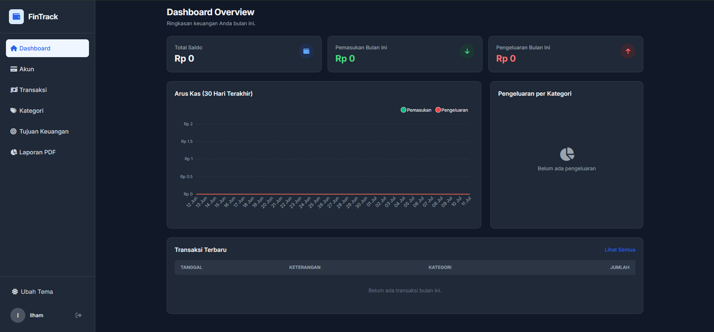
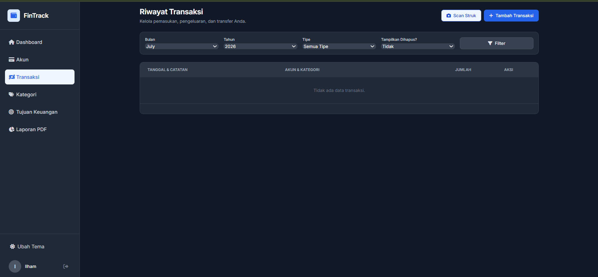
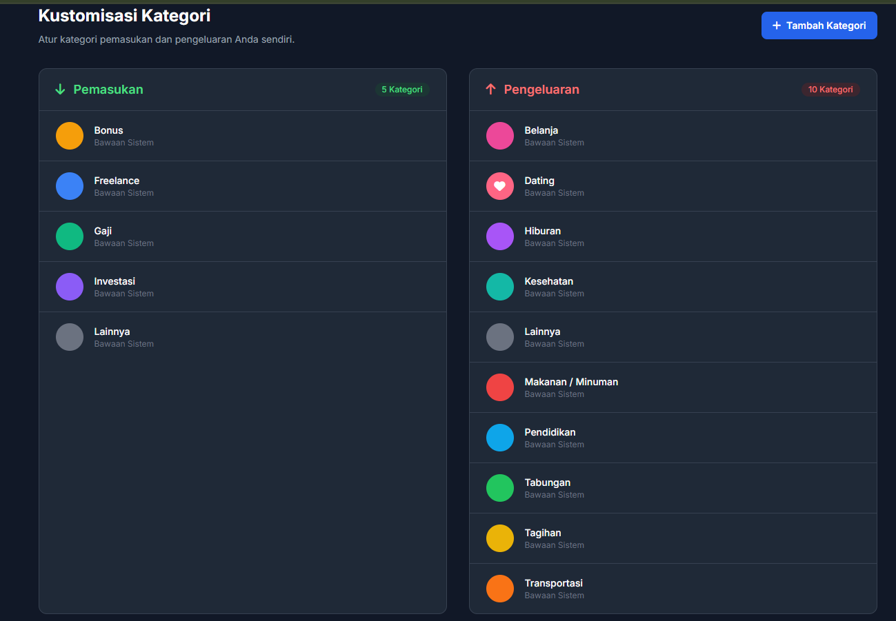

<div align="center">


# 💰 FinTrack — Personal Finance Manager

**Aplikasi manajemen keuangan pribadi yang modern, intuitif, dan powerful.**  
Catat pemasukan & pengeluaran, atur anggaran, dan capai tujuan keuangan Anda dengan mudah.

[](https://github.com/ilhambachtiarr/FinTrack/actions/workflows/deploy.yml)


🌐 **[Live Demo](https://fintrack.infinityfree.io)** &nbsp;|&nbsp; 📖 **[Dokumentasi](#cara-instalasi)** &nbsp;|&nbsp; 🐛 **[Laporkan Bug](https://github.com/ilhambachtiarr/FinTrack/issues)**

</div>

---

## ✨ Fitur Unggulan

| Fitur | Deskripsi |
|-------|-----------|
| 📊 **Dashboard Interaktif** | Ringkasan saldo, grafik 30 hari terakhir, dan pengeluaran per kategori secara real-time |
| 💳 **Multi Akun** | Kelola beberapa akun (Bank, E-Wallet, Tunai, Investasi) dalam satu aplikasi |
| 🔄 **Manajemen Transaksi** | Catat pemasukan & pengeluaran dengan filter bulan, tahun, tipe, dan akun |
| 🎨 **Kustomisasi Kategori** | Buat kategori sendiri dengan ikon FontAwesome dan warna pilihan Anda |
| 🎯 **Tujuan Keuangan** | Tetapkan goal tabungan dan pantau progresnya secara visual |
| 📄 **Laporan PDF** | Ekspor laporan keuangan bulanan ke format PDF |
| 🌙 **Dark Mode** | Dukungan tema gelap & terang yang otomatis tersimpan |
| 📱 **Responsive** | Tampilan optimal di smartphone, tablet, maupun laptop |
| 🔐 **Keamanan** | Autentikasi aman, proteksi IDOR, dan validasi data di setiap endpoint |
| ♻️ **Soft Delete** | Transaksi yang dihapus bisa dipulihkan kapan saja |

---

## 🛠️ Tech Stack

**Backend**
- [CodeIgniter 3](https://codeigniter.com/) — PHP MVC Framework
- PHP 7.4+
- MySQL 8.0

**Frontend**
- [Tailwind CSS](https://tailwindcss.com/) — Utility-first CSS Framework
- [Alpine.js](https://alpinejs.dev/) — Lightweight JS Framework
- [ApexCharts](https://apexcharts.com/) — Interactive Charts
- [Font Awesome 6](https://fontawesome.com/) — Icon Library
- [SweetAlert2](https://sweetalert2.github.io/) — Beautiful Alerts
- [Toastr](https://github.com/CodeSeven/toastr) — Toast Notifications

**DevOps**
- [GitHub Actions](https://github.com/features/actions) — CI/CD Pipeline
- [FTP Deploy](https://github.com/SamKirkland/FTP-Deploy-Action) — Auto Deploy via FTP

---

## 📸 Screenshot


| Dashboard | Akun | Transaksi | Kategori | Anggaran | Laporan |
|:---------:|:---------:|:--------:|:--------:|:--------:|:--------:|
|  |  |  |  |  |  |

---

## ⚙️ Cara Instalasi (Lokal)

### Prasyarat
Pastikan Anda sudah memiliki:
- [Laragon](https://laragon.org/) / XAMPP / WAMP
- PHP 7.4+
- MySQL
- Git

### Langkah Instalasi

**1. Clone repository ini**
```bash
git clone https://github.com/ilhambachtiarr/FinTrack.git
cd FinTrack
```

**2. Konfigurasi database**

Buat database baru di phpMyAdmin bernama `db_keuangan_pribadi`, lalu impor file skema SQL (hubungi maintainer untuk file SQL tanpa data sensitif).

**3. Konfigurasi koneksi database**

Edit file `application/config/database.php`:
```php
$db['default']['hostname'] = 'localhost';
$db['default']['username'] = 'root';
$db['default']['password'] = '';
$db['default']['database'] = 'db_keuangan_pribadi';
```

**4. Konfigurasi base URL**

Edit file `application/config/config.php`:
```php
$config['base_url'] = 'http://localhost/FinTrack/';
```

**5. Jalankan aplikasi**

Buka browser dan akses: `http://localhost/FinTrack`

---

## 🚀 Deployment (CI/CD)

Project ini menggunakan **GitHub Actions** untuk auto-deploy ke hosting setiap kali ada `git push`.

```bash
# Setelah melakukan perubahan
git add .
git commit -m "feat: deskripsi perubahan"
git push
```

GitHub Actions akan otomatis men-deploy ke live server. Pantau statusnya di tab **[Actions](https://github.com/ilhambachtiarr/FinTrack/actions)**.

### Setup Secrets (Wajib untuk deploy)

Tambahkan secrets berikut di **Settings > Secrets > Actions**:

| Secret | Keterangan |
|--------|------------|
| `FTP_SERVER` | Hostname FTP hosting Anda |
| `FTP_USERNAME` | Username FTP hosting Anda |
| `FTP_PASSWORD` | Password FTP hosting Anda |

---

## 📁 Struktur Proyek

```
FinTrack/
├── application/
│   ├── config/          # Konfigurasi aplikasi
│   ├── controllers/     # Controller (Auth, Dashboard, Transaction, dll)
│   ├── models/          # Model database
│   └── views/           # Template & halaman UI
│       ├── auth/        # Login, Register, Reset Password
│       ├── dashboard/   # Halaman utama
│       ├── transaction/ # Manajemen transaksi
│       ├── kategori/    # Kustomisasi kategori
│       ├── akun/        # Manajemen akun
│       ├── goal/        # Tujuan keuangan
│       └── layouts/     # Layout utama (sidebar, header)
├── system/              # CodeIgniter core
├── uploads/             # File upload pengguna (foto profil, dll)
├── .github/
│   └── workflows/
│       └── deploy.yml   # CI/CD pipeline
└── index.php
```

---

## 🤝 Kontribusi

Kontribusi sangat disambut! Berikut caranya:

1. **Fork** repository ini
2. Buat branch baru: `git checkout -b feat/fitur-baru`
3. Commit perubahan: `git commit -m 'feat: tambah fitur baru'`
4. Push ke branch: `git push origin feat/fitur-baru`
5. Buat **Pull Request**

---

## 📝 Changelog

### v1.0.0
- ✅ Dashboard dengan grafik interaktif
- ✅ Multi-akun (Bank, E-Wallet, Tunai, Investasi)
- ✅ Manajemen transaksi dengan filter & pagination
- ✅ Kustomisasi kategori (ikon + warna)
- ✅ Tujuan keuangan (Financial Goals)
- ✅ Laporan PDF
- ✅ Dark Mode
- ✅ CI/CD dengan GitHub Actions

---

## 📄 Lisensi

Didistribusikan di bawah lisensi **MIT**. Lihat [`LICENSE`](LICENSE) untuk informasi lebih lanjut.

---

<div align="center">

Dibuat dengan ❤️ oleh **[Ilham Bachtiar](https://github.com/ilhambachtiarr)**

⭐ Jika project ini bermanfaat, jangan lupa beri **Star**!

</div>
